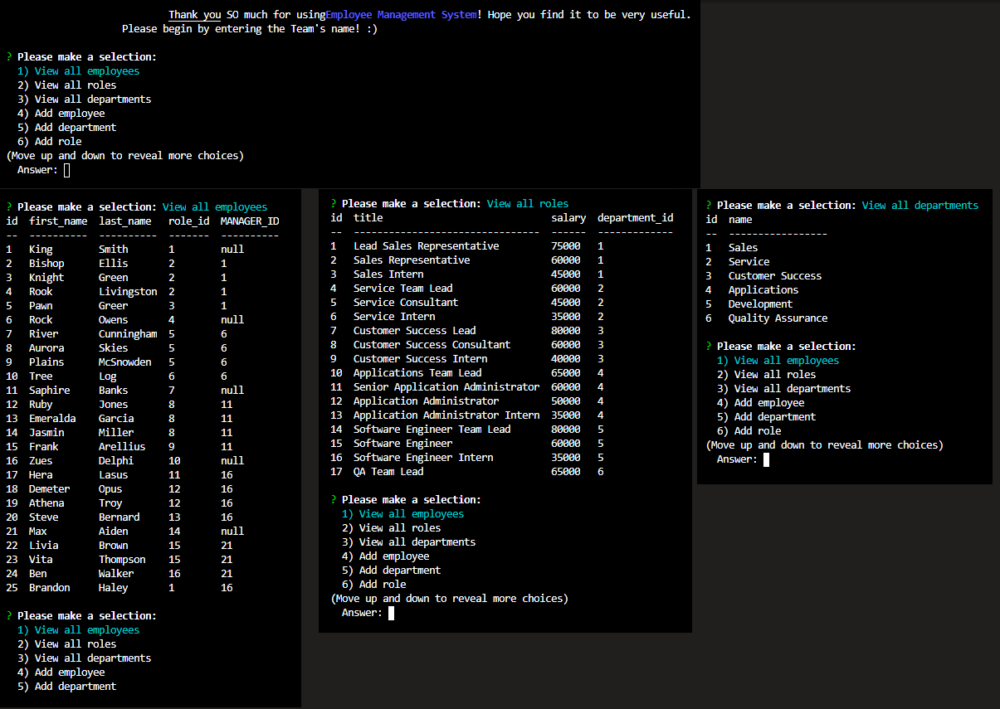

# Employee Tracker

## General 📖
---    
- Author:         Brandon Haley
- Email:          Kyle7286@gmail.com
- Github:         https://github.com/Kyle7286/
- Repo:           https://github.com/Kyle7286/employee-tracker
- Video:          https://drive.google.com/file/d/1lA4DnpaON8kNmqXD04kqsMSCb09GXYxs/view

## About/Purpose ❔
---
The purpose of this application is to allow the management of a employee system which takes in commands that the user selects to add departments, roles, employees, update details and view the current data.  All data is stored in a mySQL db backend.

## Installation
---
`npm i` to install all libraries required to run this application.

## How to Use
---
1. create a `.env` file in the root directory and enter the following information for your database:
    * DB_HOST=
    * DB_PORT=
    * DB_USER=
    * DB_PASS=
    * DB_NAME=
2. run: `node index` or `npm start`
3. Make a selection on what you want to do
4. Follow the prompts

## Testing
---
No tests / N/A

## Takeaways 🥡
--- 
* Learned how to create SQL quries
* Learned how to write code to view, add and edit database details
* Learned how to use the dotenv to hide sesnitive information

## Screenshot/Gif 📊
---
https://drive.google.com/file/d/1lA4DnpaON8kNmqXD04kqsMSCb09GXYxs/view

## Thank you 👍 
---
Thank you for your time reviewing my project/code!